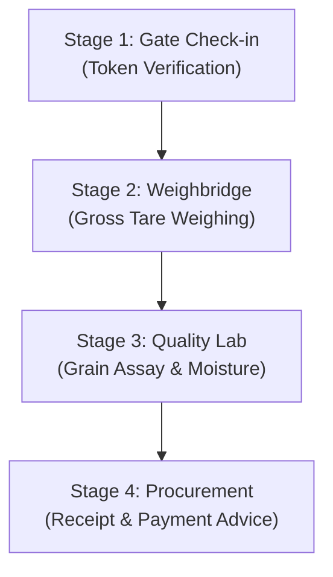

# Government-Grade Real-Time Procurement Coordination Platform

> A resilient, high-throughput, multi-stage procurement coordination and arrival window scheduling system built for agricultural mandis under government Minimum Support Price (MSP) operations.

---

## 1. Project Overview

During peak harvest seasons (Rabi & Kharif), thousands of farmers arrive at agricultural procurement centres (mandis) simultaneously. Traditional manual or static token systems lead to:
- **Massive Yard Congestion**: Long queues of tractors and trucks spilling onto highways.
- **Phantom Capacity Allocation**: Assigning arrival windows when physical weighbridges or quality testing labs are already backlogged.
- **Physical Yard Disruption**: Single point-of-failure breakdowns halting the entire mandi.
- **Lack of Real-Time Coordination**: No dynamic adaptation when farmers cancel, arrive late, or fail to show up.

This platform solves these challenges through a **deterministic constraint-based scheduler**, a **multi-stage physical yard pipeline**, **dynamic adaptation algorithms**, **real-time WebSocket updates**, and **fail-safe government integrations**.

---

## 2. Multi-Stage Yard Coordination Workflow

Every procurement mandi is modeled as a 4-stage sequential physical pipeline:



### Core Invariants & Safety Principles
- **Physical Reality Respected (Section 11)**: Arrival slots are matched against the physical bottleneck stage throughput (e.g. Weighbridge capacity in Quintals/hour) and yard vehicle parking limits (`maxSimultaneousVehicles`). No phantom slots are ever allocated.
- **AI Advisory Boundary (Section 31 & 32)**: Machine learning models provide estimated service durations and arrival pattern advisories. Predictive models **never** override physical constraints, yard safety caps, or scheduler decisions.
- **Zero-Disruption Fallback (Section 21 & 24)**: Physical yard procurement continues locally without halting even if central government APIs timeout or Redis cache becomes unreachable.
- **Immutable Audit Trail (Section 26)**: Every single scheduling, cancellation, and adaptation verdict is permanently recorded in `scheduling_decisions`.

---

## 3. Phase-Wise Feature Matrix

| Phase | Core Domain | Key Capabilities & Technical Features Implemented |
| :--- | :--- | :--- |
| **Phase 1** | **Foundations & Domain Models** | - Authoritative schemas for Centres, Counters, Farmers, Bookings, Arrival Windows, and Users.<br>- `GovernmentDataProvider` interface and comprehensive mock with realistic MP mandi datasets.<br>- Strict TypeScript strict-mode adherence and audit schemas. |
| **Phase 2** | **Auth, RBAC & Booking Intake** | - Mobile OTP authentication with rate limiting, attempt throttling, and auto-provisioning.<br>- RBAC guards across 6 roles (`FARMER`, `CHECKIN_OPERATOR`, `WEIGHING_OPERATOR`, `QUALITY_OPERATOR`, `CENTRE_ADMIN`, `STATE_ADMIN`).<br>- Daily sanctioned capacity ceiling enforcement and idempotent booking intake. |
| **Phase 3** | **Constraint Scheduler & Queue Engine** | - Multi-stage bottleneck capacity scheduler (`evaluateBookingConstraints`).<br>- Dynamic Adaptation Engine (`recomputeScheduleOnFreedCapacity`) evaluating freed slots against quantity fit and 45m transit reachability.<br>- 11-state Queue State Machine (`BOOKED` $\to$ `COMPLETED`).<br>- Mechanical counter breakdown recomputation (`recomputeOnCounterBreakdown`). |
| **Phase 4** | **Centre Operations & Command Centre** | - Role-specific operator workflows across all 4 stages (tare gross weighing, lab quality assay).<br>- Centre Administrator live queue and counter management dashboard.<br>- Government Command Centre with jurisdictional drill-down (State $\to$ District $\to$ Centre).<br>- Asynchronous government sync retry queue. |
| **Phase 5** | **Real-Time WebSockets & Event Bus** | - Decoupled in-memory `EventBusService` with Redis Pub/Sub multi-instance scaling.<br>- Socket.IO WebSocket Gateway broadcasting live queue state transitions and token calls.<br>- Resilient in-memory fallback for zero-downtime operation when Redis disconnects. |
| **Phase 6** | **Prediction Engine (Advisory Only)** | - Deterministic baseline moving-average service time and arrival pattern forecasting.<br>- Confidence scoring and uncertainty bounds.<br>- Hardened scheduler consumer: predictions only calibrate duration estimates; never override physical constraints. |
| **Phase 7A**| **Security & Failure Resilience** | - Refresh-token family rotation and reuse attack revocation.<br>- Helmet headers, CSRF origin verification, input sanitization, and distributed rate limiting.<br>- Concurrency race-condition tests (last capacity unit lock), database mid-transaction aborts, and government gateway timeout resilience. |
| **Phase 7B**| **Production Readiness & Deployment** | - Multi-stage containerized `Dockerfile` with non-root user and curl healthcheck.<br>- Docker Compose environments for development and production.<br>- Container probes (`GET /health`, `GET /ready`, `GET /live`).<br>- Full 6-document Government Integration Specification suite.<br>- Automated 6-step Section 42 Demonstration Scenario runner. |

---

## 4. How to Run Locally

### Prerequisites
- **Node.js**: v20.x or v24.x (Tested on v24.2.0)
- **npm**: v10.x or higher
- **MongoDB** *(Optional for local dev)*: Local instance or Docker container (Unit/integration tests use self-contained in-memory `mongod`).
- **Redis** *(Optional for local dev)*: Automatically falls back to resilient in-memory store if Redis is absent.

### Quickstart (Local Development)

1. **Clone the Repository**:
   ```bash
   git clone <repo-url>
   cd FIreBaseAntigravityProject/backend
   ```

2. **Install Dependencies**:
   ```bash
   npm install
   ```

3. **Configure Environment Variables**:
   Copy the provided development environment profile:
   ```bash
   cp .env.development .env
   ```
   *(Or on Windows PowerShell: `Copy-Item .env.development .env`)*

4. **Build the TypeScript Application**:
   ```bash
   npm run build
   ```

5. **Start the Development Server**:
   ```bash
   npm run start:dev
   ```
   The backend API will start listening at `http://localhost:3000/api/v1` with root health endpoints at `http://localhost:3000/health`.

### Running with Docker Compose
To run the full stack with production-parity MongoDB and Redis:

```bash
docker-compose up --build
```
*(Requires Docker Desktop installed).*

---

## 5. Testing & Verification

### Running the Full Test Suite
To run all 17 unit, integration, and failure-recovery test suites:

```bash
cd backend
npm test -- --runInBand
```

**Test Coverage Summary**:
- `tests/integration/health-probes.integration.spec.ts` (Container healthchecks)
- `tests/integration/auth-flow.integration.spec.ts` (OTP & JWT workflows)
- `tests/integration/phase2-booking-capacity.integration.spec.ts` (Booking intake & caps)
- `tests/integration/phase4-operations-command-centre.integration.spec.ts` (Operator workflows)
- `tests/integration/phase5-redis-websockets-events.integration.spec.ts` (WebSockets & Redis failover)
- `tests/integration/phase6-predictions-scheduler.integration.spec.ts` (Prediction engine advisory integration)
- `tests/integration/phase7-security-hardening.integration.spec.ts` (Security defenses)
- `tests/integration/phase7-failure-recovery.integration.spec.ts` (Concurrency & network fault resilience)
- `tests/unit/*.spec.ts` (Scheduler, queue state machine, centres, bookings, audit, RBAC)

---

## 6. Load Testing Strategy (Section 34 & 44)

Per Section 44 (*"No fake performance metrics or misrepresentation"*), the platform provides two distinct, purpose-built benchmark suites with clear separation of scope:

### Comparison Overview

| Metric Dimension | `test:load` (In-Process Benchmark) | `test:load:http` (Genuine HTTP Stack) |
| :--- | :--- | :--- |
| **Command** | `npm run test:load` | `npm run test:load:http` |
| **Execution Layer** | Direct in-process TypeScript function calls | Real TCP HTTP network requests over loopback |
| **Network Overhead** | None (0ms loopback) | Full Express routing, Helmet headers, JSON parser |
| **Database Engine** | MockModel JavaScript object mutations | Real `mongod.exe` v6.0.14 binary over TCP wire |
| **Authentication** | Direct service method invocation | Real `JwtAuthGuard` & `RolesGuard` verification |
| **Validation** | In-memory object parameters | Real `ValidationPipe` (class-validator reflection) |
| **WebSocket** | In-memory event bus callbacks | Real Socket.IO client over TCP WebSocket |
| **Primary Purpose** | CPU algorithmic limit & logic profiling | Realistic end-to-end system throughput SLA |

---

### Benchmark A: In-Process Algorithm / Logic Benchmark
```bash
cd backend
npm run test:load
```
- **File**: [`backend/tests/load/load-test-benchmark.ts`](backend/tests/load/load-test-benchmark.ts)
- **What It Measures**: Pure CPU throughput of the constraint scheduler, state transition rules, and memory contention across 50 virtual users.
- **Measured Results on AMD Ryzen 7 7735HS (16 cores, 16GB RAM)**:
  - **Scheduler Constraint Evaluations**: **2,736.7 to 5,593.4 ops/sec** (p50: 0.17ms - 0.31ms)
  - **In-Memory Contention Intake**: **84,840.7 to 196,811.7 req/sec**
  - **Queue State Transitions**: **1,919,017.5 updates/sec** (p50: 0.00ms)

---

### Benchmark B: Genuine HTTP Network & Real MongoDB Wire Load Test
```bash
cd backend
npm run test:load:http
```
- **File**: [`backend/tests/load/http-load-test.ts`](backend/tests/load/http-load-test.ts)
- **What It Measures**: Complete end-to-end production request lifecycle over TCP sockets with Helmet, JWT security guards, DTO validation, and disk-backed `mongod` BSON wire queries.
- **Measured Results on AMD Ryzen 7 7735HS (16 cores, 16GB RAM)**:
  - **Authenticated Booking Intake (`POST /api/v1/bookings`)**:
    - Real HTTP Throughput: **247.8 req/sec**
    - Round-Trip Latency: **p50 = 31.47 ms**, **p95 = 105.36 ms**, **p99 = 106.04 ms**
    - Unexpected Errors: **0.00%**
  - **Health Probes with Live DB Ping (`GET /health`)**:
    - Real HTTP Throughput: **1,202.3 req/sec**
    - Round-Trip Latency: **p50 = 14.83 ms**, **p95 = 26.43 ms**, **p99 = 54.96 ms**
  - **Socket.IO TCP WebSocket Latency**: **62.21 ms**

---

## 7. Real-World Demonstration Scenario (Section 42)

To run the automated, end-to-end 6-step mandi scenario:

```bash
cd backend
npm run demo:sih
```

### Scenario Sequence & Verification:
1. **F1 (On-Time Arrival)**: Farmer 1 checked in at Gate 1; Token `T-001` issued; status set to `CHECKED_IN`.
2. **F2 (Late Arrival)**: Farmer 2 arrives 35 minutes late. Grace period protocol preserves the booking; downstream arrival buffer incremented (+35m dynamic ETA update).
3. **F3 (Physical Yard Processing)**: Gross vehicle weighing (40.0Q on Scale 1) $\to$ Quality lab assay (Grade A, moisture 11.4%) $\to$ Procurement finalized (`COMPLETED`).
4. **F4 (Farmer Cancellation)**: 40Q capacity freed up in Slot 1 (10:00 - 11:00 AM).
5. **F5 (No-Show)**: Grace window expires; marked `NO_SHOW`; capacity pooled into Slot 1.
6. **Counter 2 (Mechanical Breakdown)**: Weighbridge 2 marked `MAINTENANCE`; stage hourly throughput derated from 55Q/hr to 30Q/hr; affected windows flagged.
7. **Dynamic Downstream Adaptation**:
   - **Candidate A (`BK-CAND-A`, 25Q)**: Fits freed slot capacity & satisfies 45m transit notice $\to$ **`MOVED_FORWARD`** into Slot 1.
   - **Candidate B (`BK-CAND-B`, 50Q)**: Exceeds remaining freed capacity (15Q) $\to$ **`UNALTERED`** in Slot 3.
   - **Audit Trail**: Decision records permanently stored in `scheduling_decisions`.

---

## 8. Government Integration Documentation Index (Section 39)

Complete architectural and protocol specifications are located in [`docs/integration/`](docs/integration/):
- [`government-api-contract.md`](docs/integration/government-api-contract.md): `GovernmentDataProvider` interface specification
- [`authentication.md`](docs/integration/authentication.md): mTLS, OAuth2 client credentials, HMAC-SHA256 signatures
- [`data-mapping.md`](docs/integration/data-mapping.md): Field crosswalk between state portals and platform schema
- [`sync-strategy.md`](docs/integration/sync-strategy.md): Webhook push notifications vs scheduled reconciliation
- [`failure-handling.md`](docs/integration/failure-handling.md): Circuit breaker, exponential backoff, DLQ, zero physical disruption
- [`reconciliation.md`](docs/integration/reconciliation.md): Daily 3-way reconciliation ledger and variance resolution
