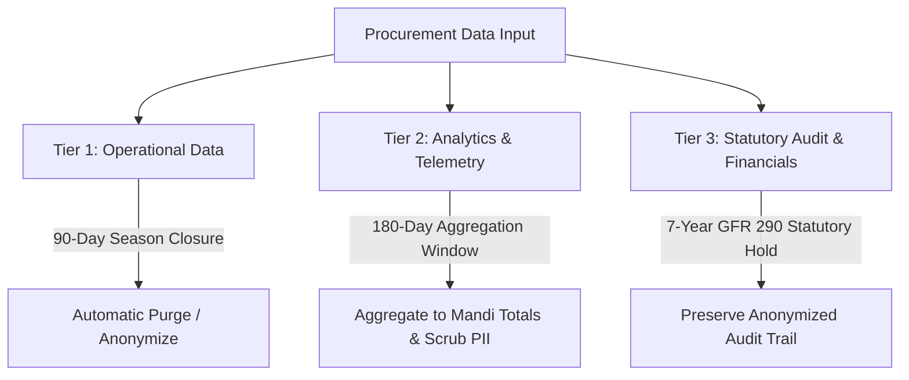

# Statutory Privacy Policy & Personal Data Governance Charter
**National MSP Grain Procurement Coordination Platform**
*Drafted pursuant to India's Digital Personal Data Protection (DPDP) Act, 2023, Information Technology Act, 2000, and General Financial Rules (GFR), 2017.*

**Document Control:**
- **Version:** DPDP-2023-V1.0
- **Effective Date:** September 14, 2026
- **Jurisdiction:** Republic of India
- **Applicable Statute:** Digital Personal Data Protection Act, 2023 (Act No. 22 of 2023)
- **Data Fiduciary:** Department of Agriculture & Farmers Welfare, Ministry of Agriculture, Government of India, in coordination with State Civil Supplies Corporations and State Agricultural Marketing Boards (Mandi Boards).

---

## 1. Preamble & Regulatory Objectives

The National MSP Grain Procurement Coordination Platform ("Platform") operates as a mission-critical government infrastructure system to coordinate the physical procurement of notified agricultural commodities at Minimum Support Price (MSP). This charter governs the collection, recording, processing, storage, sharing, and disposal of digital personal data of farmers, transporters, and mandi personnel, in strict compliance with the **Digital Personal Data Protection Act, 2023 (DPDP Act)**.

The Platform adheres to the core constitutional and statutory data protection principles:
1. **Lawfulness & Transparency:** Processing personal data solely under valid statutory grounds (Consent or Legitimate Use).
2. **Purpose Limitation:** Restricting processing strictly to MSP allocation, dynamic yard coordination, quality verification, and direct subsidy payments.
3. **Data Minimisation:** Collecting only the irreducible minimum data elements necessary to prevent procurement fraud and execute disbursement.
4. **Storage Limitation:** Purging operational buffers within specified retention windows while preserving statutory audit records under public finance laws.
5. **Integrity & Confidentiality:** Preventing unauthorized disclosure, scraping, or leakage of agricultural producer data.

---

## 2. Roles & Governance Architecture

| Role under DPDP Act | Entity | Legal Responsibility |
| :--- | :--- | :--- |
| **Data Fiduciary** | Department of Agriculture & Farmers Welfare, Government of India | Determines purpose and means of processing; ensures statutory compliance and grievance resolution. |
| **Joint Data Fiduciaries** | State Civil Supplies Corporations & State Mandi Boards | Co-determine localized operational scheduling and mandi physical gate access. |
| **Data Processors** | Sanctioned Procurement Agencies (e.g., FCI, NAFED, State Agencies), Authorized Weighbridge Operators, and Certified Quality Testing Labs | Process grain weight and moisture assay data under binding government service-level agreements. |
| **Data Principal** | Registered Farmer / Agricultural Producer | The natural person whose personal data is processed for scheduling and MSP payment. |
| **Consent Manager / DPO** | Data Protection Officer (DPO), Ministry of Agriculture | Oversees compliance, audits processing logs, and adjudicates data principal grievances. |

---

## 3. Categories of Personal Data Processed & Purpose Specification

In accordance with Section 4 and Section 5 of the DPDP Act, personal data is categorized and processed solely for specified purposes:

| Data Category | Specific Elements Collected | Statutory Processing Purpose | Lawful Basis (DPDP Act) |
| :--- | :--- | :--- | :--- |
| **Identity & Contact Data** | Full Name, 10-digit Mobile Number, Farmer Registration Number | Farmer authentication, digital arrival token issuance, SMS/WhatsApp dispatch of slot schedules and gate entry passes. | **Section 6(1)** (Explicit Consent) & **Section 7(b)** (Government Subsidy/Benefit Provision) |
| **Land & Cultivation Records** | State, District, Sub-District (Tehsil), Village, Cultivated Land Area (Acres), Crop Variety | Verification of production ceiling against sanctioned limits to eliminate non-farmer intermediary hoarding. | **Section 7(b)** (Authoritative Government Scheme Implementation) |
| **Yard & Logistics Telemetry** | Vehicle Registration/Tractor Number, Gate Entry Timestamp, Gross Weight, Tare Weight | Real-time queue allocation, weighbridge slot scheduling, anti-congestion yard traffic management. | **Section 6(1)** (Operational Consent) |
| **Quality & Assay Records** | Moisture Percentage, Foreign Matter (Dockage), Grade Conformance | Grade determination to authorize MSP rate calculation and grain receipt issuance. | **Section 7(b)** (Procurement Standards Verification) |
| **Financial Audit Telemetry** | Bank Account Verification Flag, IFSC code, Payment Advice Reference, DBT Credit Status | Processing electronic Payment Advice (EPA) and crediting MSP funds directly into Aadhaar-seeded accounts via PFMS/DBT. | **Section 7(b)** (Public Benefit Disbursement) |

> [!NOTE]
> **Data Minimisation Exclusion:** The Platform strictly **DOES NOT** store raw Aadhaar numbers, biometric data, religion, caste, detailed tax records, or unmasked complete bank credentials. Landholding verification is obtained by validating registration numbers against authoritative state land record repositories (e.g., MP Bhulekh).

---

## 4. Consent Framework & Consent Revocation (Section 6)

1. **Affirmative Consent:** At the time of self-registration or first portal access, farmers are presented with an unambiguous, un-ticked consent notice. By selecting the consent checkbox, the farmer explicitly authorizes:
   - Verification of agricultural landholding records against state portals.
   - Processing of mobile numbers for dynamic gate queue SMS alerts.
   - Transmission of grain quantity and grade records to the Public Financial Management System (PFMS) for Direct Benefit Transfer.
2. **Immutable Consent Log:** Every consent event is recorded with cryptographic timestamp, client IP address, user-agent string, and policy version reference in the immutable `farmer_consents` audit repository.
3. **Right to Revoke Consent:** Under Section 6(4) of the DPDP Act, a farmer may revoke consent at any time via portal self-service or through the Mandi Helpdesk. Upon revocation, all non-statutory processing ceases, and the account is deactivated.

---

## 5. Data Subject Rights (Sections 11, 12, 13 & 14)

The Platform guarantees the following enforceable rights to every registered Data Principal:

### A. Right to Access & Data Portability (Section 11)
Any farmer may request an exhaustive digital copy of their personal data processed across all procurement systems.
- **Endpoint:** `GET /api/v1/farmers/data-export`
- **Output:** Machine-readable JSON package containing personal profile, active consents, token reservations, gross/tare weighment tickets, quality test records, payment advices, and records of who accessed their personal data.

### B. Right to Correction & Updating (Section 12(1))
Farmers may update non-authoritative profile preferences (contact address, preferred language for SMS) directly via `PATCH /api/v1/farmers/profile`. Updates to authoritative landholdings must be processed through the state revenue/land registry interface to prevent fraudulent quota manipulation.

### C. Right to Erasure / Account Deletion (Section 12(3))
Farmers may submit an account erasure request via `DELETE /api/v1/farmers/account`.
- **Anonymization of PII:** Upon receipt, personal identifiers (name, mobile phone number, residential address, device telemetry) are irreversibly pseudonymized and scrubbed from operational tables.
- **Statutory Financial Retention Hold (GFR Exception):** Under Section 12(3) and Section 8(7) of the DPDP Act, personal data required for compliance with Indian law or legal proceedings **is legally exempt from destruction**. Specifically:
  - **Rule 290 of General Financial Rules (GFR), 2017** and Comptroller and Auditor General (CAG) audit standards mandate that records relating to public procurement, physical grain weight certificates, and public expenditure disbursements **must be preserved for a statutory period of 7 years**.
  - Accordingly, physical weighment values, net grain quantities, commodity types, MSP financial amounts, and system audit logs are preserved in an **anonymized, pseudonymized format** (`ANONYMIZED_FARMER_<id>`) for audit verification without linking back to the individual farmer's active identity.

### D. Right of Grievance Redressal (Section 13)
Any farmer aggrieved by data processing activities may lodge an appeal with the designated Data Protection Officer. All grievances must be acknowledged within 24 hours and resolved within 7 business days.

---

## 6. Three-Tier Data Retention Policy (Section 38 Specification)

The Platform categorizes and manages digital data across three strictly segregated lifecycle tiers:

### Tier 1: Operational Queue & Buffer Data
- **Scope:** Dynamic arrival tokens, yard tractor queue buffers, temporary counter assignment states, SMS dispatch queues, ephemeral OTP verification codes.
- **Retention Period:** **90 days** following official procurement season closure.
- **Purge Mechanism:** Automated backend retention cron job permanently deletes temporary queue states and scrubs transient yard tracking records.

### Tier 2: Analytical & Capacity Data
- **Scope:** Hourly mandi throughput statistics, slot capacity utilization rates, bottleneck prediction metrics, regional crop inflow trends.
- **Retention Period:** **180 days** for granular records.
- **Purge Mechanism:** Granular transaction records are aggregated into monthly anonymous statistical summaries (e.g., total metric tons procured per mandi per commodity). Direct farmer references and vehicle registration identifiers are stripped.

### Tier 3: Statutory Financial & Audit Records
- **Scope:** Cryptographically signed Electronic Weighment Tickets, Quality Assay Certificates, Electronic Payment Advices, DBT Treasury Confirmation numbers, and Administrative Audit Logs (`audit_logs`).
- **Retention Period:** **7 Years (Statutory Financial Audit Hold)** pursuant to GFR 2017 Rule 290, Public Financial Management System guidelines, and Section 8(7) of the DPDP Act.
- **Protection:** Immutable, append-only storage protected by role-based access control and cryptographic hash chains.

---

## 7. Data Processing Log (RoPA / Section 8 Compliance)

Separate from the system's operational transaction log, the Platform maintains a dedicated **Data Processing Log** (`data_processing_logs`) recording every read, query, export, or transmission of farmer PII:
- **Accessor Identity:** User ID, Name, Role (e.g., Gate Operator, Quality Assayer, Admin), IP Address, and User Agent.
- **Data Subject:** Farmer ID and masked mobile number.
- **Data Elements Accessed:** Explicit list of PII categories inspected (e.g., `['NAME', 'MOBILE', 'LAND_RECORDS']`).
- **Lawful Processing Purpose:** Operational reason (e.g., `GATE_CHECKIN_VERIFICATION`, `QUALITY_ASSAY_VERIFICATION`, `DATA_SUBJECT_EXPORT`).
- **Statutory Basis:** Referenced section of the DPDP Act 2023.

This log enables independent compliance audits and gives farmers full visibility into who has inspected their personal data.

---

## 8. Data Security Safeguards (Section 8(5))

1. **Encryption in Transit:** All HTTP exchanges are strictly enforced over TLS 1.3 with Perfect Forward Secrecy; WebSockets enforce WSS with JWT handshake validation.
2. **Encryption at Rest:** Sensitive database volumes enforce AES-256 encryption.
3. **Role-Based Access Control (RBAC):** Strict least-privilege scoping:
   - Mandi weighbridge operators cannot view farmer bank details or land survey coordinates.
   - Public dashboards display only aggregated counts (quintals, tractor counts, average wait time) with zero farmer PII.
4. **Data Breach Notification:** In the event of a personal data breach, the Data Fiduciary shall notify the Data Protection Board of India and affected data principals in accordance with Section 8(6) of the DPDP Act.

---

## 9. Contact & Grievance Redressal Officer

For questions, requests for data export, or complaints regarding personal data handling:

- **Office:** Data Protection & Grievance Redressal Cell
- **Designated Authority:** Central Data Protection Officer (DPO)
- **Ministry:** Department of Agriculture & Farmers Welfare, Government of India
- **Address:** Krishi Bhawan, Dr. Rajendra Prasad Road, New Delhi 110001, India
- **Toll-Free Kisan Call Centre:** 1800-180-1551
- **Official Compliance Email:** privacy.procurement@gov.in
- **Online Grievance Redressal:** Centralized Public Grievance Redress and Monitoring System (CPGRAMS)
